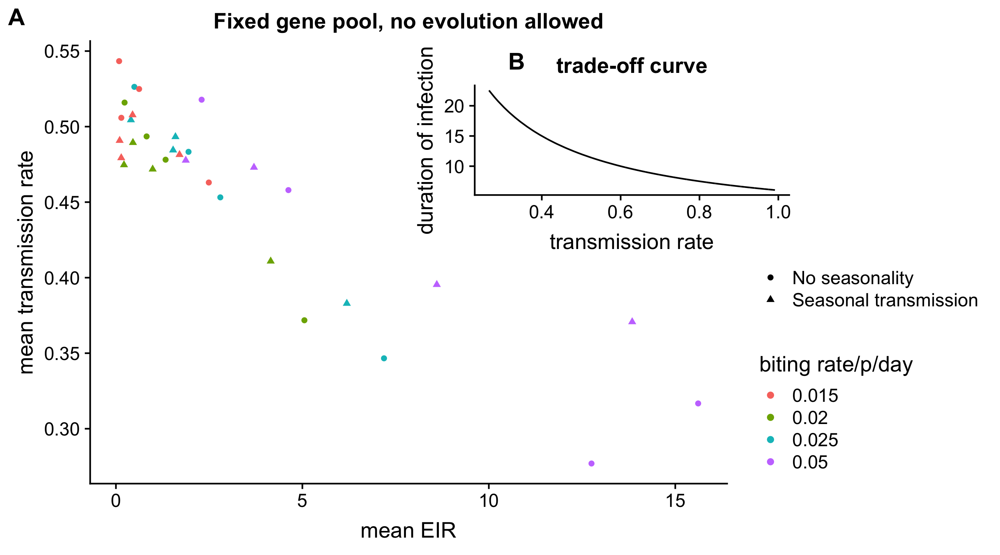

```{r setup, include=FALSE}
knitr::opts_chunk$set(echo = TRUE)
```
# Diversification in receptors and local density-dependent selection could be key to diverse functional group of antigens

Authors: Qixin He, Mercedes Pascual

## Main text

This project is to decipher how or what kind of within-host dynamics would influence the evolutionary fate of antigens.

## Abstract

In most parasite-host dynamics, evolutionary timescales cannot be separated from ecological timescales. The long-term evolutionary fate of a parasite gene family could be potentially determined by many ecological factors of within-host dynamics. It is usually hard to disentangle these factors (i.e., understand which ones are the cause and which are consequences) because they could lead to similar patterns. Here we investigate the evolution of a gene family that codes the major antigen during blood transmission stage of malaria, the *var* genes. Three categories of ecological factors influence the fate of a gene: those that determine the parasites' growth rate, duration of infection, and diversification rates. We found that through many combinations of factors that influence these three traits, evolutionary force consistently selects for high diversity of genes, low overlap between strains and minimal differences in absolute fitnesses of genes. Despite potential tradeoffs could exist to minimize the absolute differences between genes, fast evolutionary rates of genes will result in genes with the highest absolute fitnesses given large effective population size of parasites. More importantly, stable composition of genes of different absolute fitnesses could only exist if they bind to plethora of receptors which will have density-dependent selection among parasites within the same receptors but not between. Therefore, we hypothesize that partition in receptor binding and the existence of human polymorphism in receptors are the key to diversification and stable existence of different ups groups of *var* genes. Other related features of the genes are the consequences of effective binding to different receptors (and probably how similar and abundant the receptors are to each other). We also found that linear increase in transmission rates result in power-law increase in EIR and the number of new genes, rendering the disease scenarios into different regimes completely, which demonstrate how effective control in transmission rates could have much greater returns. When compared to empirical data, we found that regions with low transmissions have much greater variation in the composition of var ups types than regions with high transmissions. These results demonstrate that under strong selection, evolutionary force prefers diversity only when it's minimizing the competition along the axis, and temporary coexistence of different strategies could be very unstable. Through our simulation, we also showed that the age of a gene is correlated with its overall functionality, with old genes be much less likely to be dysfunctional. Prevelance of gene ages is a traveling wave: very old genes are less because they have been known by all the hosts, or mutated away, while new genes still require sometime to gain preference. 

## Introduction

### what's the background and why we study it?

Gene families involved in parasite-host armsrace evolve dynamically under birth-and-death evolution with different selection mechanisms. Relative strengths of birth-death rates and selection dictate the survival and coexistence of member genes. Parasite antigens are particularly uniquely positioned because they are under two types of selection from the host: one exherted from host immune system to escape antibody recognition from the host, one is to maintain the binding functions of the genes towards the receptors of the host membrane binding. These two forces are selecting in opposite directions of diversity: the one from immune system is to diversify the pool of protein diversity as much as possible, especially for the immunodominant regions. Binding functions towards receptors, on the other hand, selects for conservation of the protein structure so that binding is stable as well as the protein structure. Many potential trade-offs to balance cost and benefits of diversification during within-host dynamics explain the existence of a diverse array of parasite infection strategies (Fig. 1a). Lesser known is to what extent different ecological factors in within-host dynamics influence the long term evolutionary trend. In addition, if there are more general trend of what type of ecological factors would be consistently important.

### specific function of the genes

In *falciparum* malaria transmission, *var* gene family, which codes *Pf*Emp1 on the surface of infected human red blood cells, is not only the major blood-stage antigen to our immune system, but also confer binding to host epithelial cells or other non-infected red blood cells to avoid splenic clearance and enhance reproduction rates of the parasites. There are 50-60 *var* genes per parasite genome, each generation, the parasite only display one of the phenotypes to the host. Despite overall immense diversity of amino acid composition of var genes within and between parasite genomes, major groups of var genes exist based on their  5’-flanking regions called ups that control the expression of genes \supercite{Kraemer2007-zg}.

Different ups types have average difference in many features. Ups types determine {\it var} genes' propensity to exchange DNA with other {\it var} genes in the genome via ectopic recombination \supercite{Freitas-Junior2000-qw,Claessens2014-pi}. In turn, differences in recombination rate result in different levels of diversity and conservation among ups types: upsA genes form a separate recombination group which shares few homologous segments with upsB/upsC genes \supercite{Bull2008-jb,Larremore2013-te}; they display different characteristics in terms of expression order, binding affinity to host receptor proteins, as well as disease severity \supercite{Kyriacou2006-cq,Janes2011-yi}. UpsA genes are also preferentially expressed in hosts with limited immunity \supercite{Cham2009-fd,Bull2002-ch,Warimwe2009-fw}, exhibiting higher serodominance in infants than other var groups seroprevalent with age \supercite{Barry2011-oi}. 

It is hard to disentangle however, which properties are the causes and which are the consequences. And how the potential ecological differences influence the longterm evoluitonary differences between the groups. 

### possible hypotheses that explain the divergence in their properties

There are different hypotheses regarding the average differences we see in the groups. 
First, tradeoff between transmission rate and duration of infection. The binding of the gene to epithelial receptors of surfaces determine the growth rate of specific parasites. At the same time, clearance rate of immune responses could be correlated with the abundance of the parasites. Total transmissibility (Fig. 1b) is the product of transmission rate (proportional to growth rate of the parasites) and the duration of infection (negatively correlated with the speed of clearance from immune responses) (Greischar et al. 2016, Klein et al. 2014).

Two transmission strategies coexist: fast recombination at risk of producing non-functional proteins and slow recombination to maintain functions at the risk of immunity gained by hosts (Greischar et al. 2016, Klein et al. 2014). 

There's no tradeoff between transmission rate and possiblity. It's growth rate difference and the inherent recombination higher. Varying degree of recombination rates difference. But the percentage of genes are free to vary. 

Inherent rate decrease. 
Purifying selection is prevalent. positive selection among different groups. 

### how we are going about it? what questions are we answering?


## Results

### trade-off between transmission rate and duration of infection

If total transmissibility is kept constant while transmission rate and duration of infection trade off in naive hosts, then percentage of genes with lower transmission rate but higher duration of infection will be favored in higher transmission intensity.

```{r Figure 2, echo=FALSE, fig.cap="genes with longer duration is preferred when transmission intensity is high", out.width = '100%'}

```


### selection minimizes fitness differences among genes


### density-dependent receptor selection stablizes the functional group composition

### regime shift determined by effective population size

### gene age, functionality and immunity niche distribution

## Discussion

### summary of findings

### significance of these findings on our understanding of evolutionary strategies?? or parasite-host arms race

### indication of the transmission difference regimes

### a general picture of age of genes and their functions, a traveling wave

### Chesson's theory of co-existence under the context of co-evolution and constant innovation

## Methods

### basic transmission model description

### within-host dynamics options

#### trade-off between transmission rate and duration of infection
#### how co-infection influences transmission
#### recombination rates in different groups
### data availability, reproducibility


## Acknowledgements


